  

  
   
  

  
  
  
  

  

## `$ ls ./projects`

| Project | What it does | Stack |
|---|---|---|
| **[CT-SENTRY](https://github.com/ahaan-parmar/cloudtrail-triage)** | CloudTrail detection, LLM triage and auto-remediation. Detection and response stay deterministic; the LLM only explains and ranks. FPR cut from 34% to 6% on ~1.9M real events. | `Python` `boto3` `FastAPI` |
| **[gqlpwn](https://github.com/ahaan-parmar/gqlpwn)** | Low-false-positive GraphQL and AppSync scanner with exploit oracles for 7 vuln classes. Confirmed command injection at ~50x signal. | `Python` `GraphQL` `AppSync` |
| **AD Attack Lab** | Isolated Windows domain. Responder, ntlmrelayx and mitm6 chained into Domain Admin, paths mapped in BloodHound. | `Impacket` `BloodHound` |

## `$ cat ./loot`

| | |
|---|---|
| **CTFtime 2026** | #279 worldwide, #23 in India with Team SudoWin |
| **CyberSiege CTF** | 1st place, 2025 and 2026 |
| **Tech Solistics** | 1st place, MIT Bengaluru |
| **Kaspersky Hackathon** | 4th of 600+ |
| **Manipal M#** | Top 10 of 850+ |
| **Publication** | *AI-Driven Data Analytics for Real-Time Decision-Making*, IJPREMS Vol. 05 (2025) |
| **Certs** | eJPTv2, THM Jr Penetration Tester, OSCP+ (in progress) |

## `$ ./telemetry`

  
  

  

  <picture>
    <source media="(prefers-color-scheme: dark)" srcset="https://raw.githubusercontent.com/ahaan-parmar/ahaan-parmar/output/github-snake-dark.svg" />
    <source media="(prefers-color-scheme: light)" srcset="https://raw.githubusercontent.com/ahaan-parmar/ahaan-parmar/output/github-snake.svg" />
    
  </picture>

